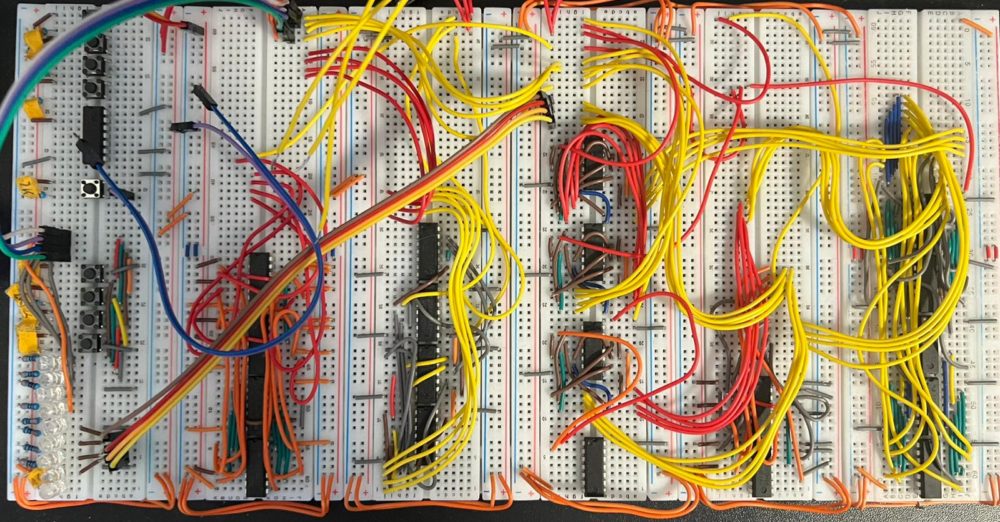

<table style="width:100%; border:none;">
<tr>
<td style="vertical-align:top; padding-right:30px;">

## Hi there 👋
## Welcome to Leonard's corner of GitHub

Ein IC-Computer, aufgebaut aus Logikgattern, der den Aufbau eines kleinen funktionsfähigen Prozessors demonstriert.

- 🔭 I’m currently in school, exploring computer science and electronics
- 🌱 I enjoy learning how to implement more complex Python algorithms
- 👯 I’m open to collaborating on coding projects, especially in Python
- 🤔 I’d love guidance on designing sleek and functional websites
- 💬 Feel free to ask me about algorithm optimization (I find it really fun!)
- 📫 Reach me via WhatsApp: 0176 20358904
- ⚡ Fun fact: I do my best coding between 4–7am

</td>
<td style="vertical-align:top; text-align:right;">

</td>
</tr>
</table>
